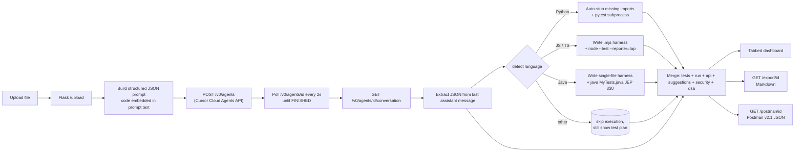
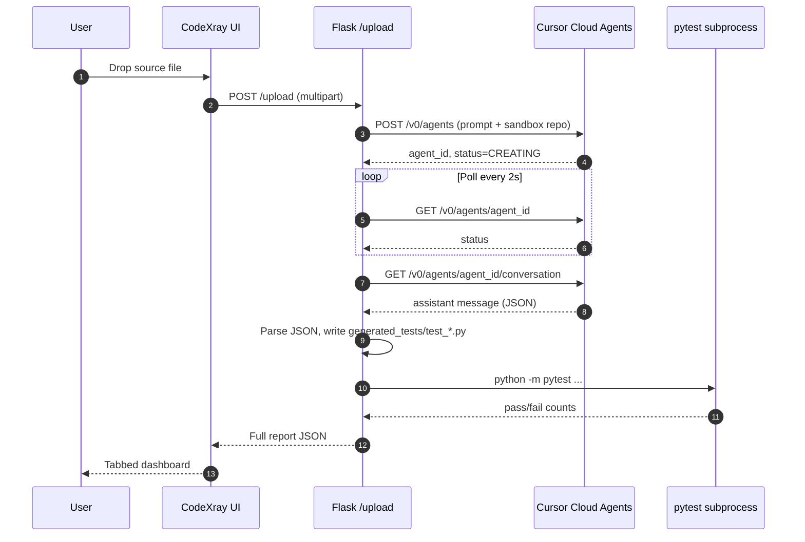

<div align="center">

# CodeXray

### Drop in any source file → AI test plan, API docs (Postman), security & DSA review. Powered by Cursor.

[](https://www.python.org/)
[](https://flask.palletsprojects.com/)
[](https://cursor.com/docs/background-agent/api/endpoints)
[](https://schema.getpostman.com/json/collection/v2.1.0/collection.json)
[](https://docs.pytest.org/)
[](https://nodejs.org/api/test.html)
[](https://openjdk.org/)
[](#-license)

**Upload code. Get a full QA + security + API + algorithms report in ~90 seconds — with real test execution for Python, JavaScript, TypeScript and Java.**

[Quick start](#-quick-start) · [Features](#-features) · [Architecture](#-architecture) · [API reference](#-http-api-reference) · [Demo flow](#-demo-flow) · [Troubleshooting](#-troubleshooting)

</div>

---

## Why CodeXray?

LLM-based code analysis usually stops at "here are some test ideas". CodeXray goes the full distance:

- It actually **runs the tests it generates** — real subprocess execution with pass/fail counts:
  - **Python** → `pytest` with auto-stubbed missing imports
  - **JavaScript / TypeScript** → Node 20+ built-in `node --test` (TAP reporter)
  - **Java** → JEP 330 single-file launcher (`java MyTests.java`) — no Maven/Gradle
- It mines your code for **HTTP endpoints + outbound calls** and ships a ready-to-import **Postman collection**.
- It surfaces **security findings with CWE references**, **DSA improvements with complexity arrows**, and **logic suggestions with side-by-side diffs** — not bullet lists.
- Everything lives in **one tabbed dashboard** with a Markdown export for offline judging.

All powered by the [Cursor Cloud Agents API](https://cursor.com/docs/background-agent/api/endpoints) — no other LLM provider involved.

---

## Features

| | Section | What you get |
|---|---|---|
| 📝 | **Summary** | 3–5 sentence overview, language detection, and notable concerns |
| 📊 | **Quality Score** | 0–100 overall + breakdown bars for *readability · maintainability · complexity · testability* |
| 🧪 | **Test Cases** | AI-generated **functional / edge / negative** cases — name, description, inputs, expected output, full test snippet (`pytest` / `node:test` / Java static methods) |
| ⚡ | **Test Run** | Real subprocess execution for **Python · JS · TS · Java** → pass / fail / error / skipped counters + per-test status table. Auto-stubs missing Python imports; uses Node's built-in test runner; uses JEP 330 single-file Java launcher (no Maven/Gradle) |
| 🌐 | **API Details** | Detected endpoints (method, path, headers, params, body, sample responses) **+** outbound HTTP calls. **One-click Postman v2.1 export.** |
| 💡 | **Suggestions** | Logic / readability / maintainability rewrites with `before` / `after` diffs, severity, and impact |
| 🔒 | **Security** | Vulnerabilities with severity (`critical`–`info`), category (auth / injection / crypto / secrets / xss / csrf), CWE id, hardened code, OWASP refs |
| 🧠 | **DSA Improvements** | Algorithm rewrites with `current → improved` complexity (e.g. `O(n²) → O(n)`), data-structure swaps, and concrete impact numbers |
| 📥 | **Exports** | One-click **Markdown report** + **Postman collection** download |

---

## Architecture



Key design decisions:

- **No fallback LLM** — strict Cursor-only. If the agent or repo is misconfigured we fail loudly so judges can verify.
- **Async-correct** — the Cloud Agents API returns `CREATING` immediately, so we always poll `/v0/agents/{id}` until a terminal status before reading the conversation. (This is what most "Cursor API hello world" snippets get wrong.)
- **Per-language test runners** — a single dispatcher (`_execute_tests`) picks `pytest` / `node --test` / `java`. Each runner writes to `generated_tests/`, runs in a subprocess with a wall-clock timeout (60s for Node, 60s for pytest, 90s for Java), and returns the same `{passed, failed, errors, skipped, total, tests, summary_line}` shape — the UI doesn't need to care which language was used.
- **Auto-stubbed dependencies (Python)** — every top-level import in the uploaded file that isn't installed in the runner's venv is replaced with `unittest.mock.MagicMock`, so tests collect without `pip install`-ing every transitive dep.
- **JEP 330 for Java** — `java MyTests.java` compiles + runs in one shot, so there's no Maven/Gradle/JUnit jar to install. `public class` declarations in the uploaded source are auto-demoted to package-private to satisfy "one public top-level type per file".
- **Runtime paths are deployable** — `JAVA_BIN` / `NODE_BIN` in `.env` override `PATH` lookup, so machines without `java` / `node` on PATH still work.
- **Reloader off** — `app.run(use_reloader=False)` prevents Werkzeug from killing the in-flight request when we write the new test file mid-flight.

---

## Quick start

### 1 · Prerequisites

**Required**

- Python 3.10+
- A Cursor account with **Cloud Agents** access — [generate an API key](https://cursor.com/dashboard/integrations)
- A GitHub repo the key can access, with **at least one commit on `main`** (the Cursor API rejects empty repos)

**Optional (only needed to auto-run tests for non-Python uploads)**

- **Node.js 20+** — enables JS / TS test execution (uses Node's built-in `--test --test-reporter=tap`, no extra packages)
- **JDK 11+** — enables Java test execution via JEP 330's single-file launcher (no Maven/Gradle)

If a runtime isn't present, the matching language's **Test Run** tab gracefully shows _"java executable not found — set `JAVA_BIN` in your .env or install JDK 11+"_; everything else (test plan, API docs, security, DSA) still works for that language.

### 2 · Install

```powershell
git clone https://github.com/Karthi-Villain/CodeXray-CursorHackathon.git
cd CodeXray-CursorHackathon
pip install -r requirements.txt
```

### 3 · Configure `.env`

| Variable | Required? | Value |
| --- | :---: | --- |
| `CURSOR_API_KEY` | yes | From <https://cursor.com/dashboard/integrations> |
| `CURSOR_REPO_URL` | yes | e.g. `https://github.com/<you>/CodeXray-sandbox` (any repo your key can access; must have a commit on `main`) |
| `CURSOR_MODEL` | no | `default`, or any id from `GET /v0/models` (e.g. `claude-4.5-sonnet-thinking`) |
| `CURSOR_TIMEOUT_SECONDS` | no | `120` (bump to `240` for very large files) |
| `JAVA_BIN` | no | Path to either the JDK home (`C:\Program Files\Java\jdk-26.0.1`) **or** the full path to `java.exe`. Only set this if `java` isn't on `PATH`. |
| `NODE_BIN` | no | Path to either the Node install dir (`C:\Program Files\nodejs`) **or** the full path to `node.exe`. Only set this if `node` isn't on `PATH`. |

### 4 · Run

```powershell
python app.py
```

Open <http://127.0.0.1:5000> and drop a source file onto the dashboard.

> Sanity-check setup at <http://127.0.0.1:5000/health> — returns Cursor + every runner's status:
>
> ```jsonc
> {
>   "ok": true,
>   "cursor_key_configured": true,
>   "runners": {
>     "python": true,
>     "node": { "available": true, "path": "...\\node.exe", "source": "PATH" },
>     "java": { "available": true, "path": "...\\java.exe", "source": "JAVA_BIN" }
>   }
> }
> ```
>
> `source` reports where the binary was actually resolved from: `PATH`, `JAVA_BIN`, `NODE_BIN`, or `null` (not found).

---

## Demo flow

> Best file to demo: a small Flask app with auth — every section lights up.



Walk judges through the tabs in this order: **All → Quality → Test Cases → Test Run → API Details → Security → DSA**. Then click **Postman** to export and import into Postman live, and **Markdown** to download the offline report.

---

## HTTP API reference

| Method | Path | Purpose |
| :---: | --- | --- |
| `GET` | `/` | Dashboard UI |
| `POST` | `/upload` | Multipart upload → returns full report JSON |
| `GET` | `/report/<id>` | Re-fetch a previously generated report (in-memory cache) |
| `GET` | `/export/<id>` | Download the report as **Markdown** |
| `GET` | `/postman/<id>` | Download a **Postman v2.1** collection |
| `GET` | `/health` | Sanity check: key configured? repo? model? |

### Sample report JSON shape

<details>
<summary>Click to expand the schema returned by <code>POST /upload</code></summary>

```jsonc
{
  "id": "ab12cd34ef56",
  "filename": "auth_routes.py",
  "language": "python",
  "agent_id": "bc-...",
  "agent_status": "FINISHED",
  "agent_url": "https://cursor.com/agents?id=bc-...",
  "summary": "...",
  "quality_score": 78,
  "quality_breakdown": { "readability": 80, "maintainability": 72, "complexity": 75, "testability": 85 },
  "test_cases": {
    "functional": [{ "name": "test_...", "description": "...", "inputs": "...", "expected": "...", "pytest_code": "..." }],
    "edge":       [],
    "negative":   []
  },
  "test_run": {
    "ran": true, "passed": 8, "failed": 1, "errors": 0, "skipped": 0, "total": 9,
    "tests": [{ "name": "test_...", "status": "PASSED" }],
    "summary_line": "8 passed, 1 failed in 0.42s"
  },
  "api_documentation": {
    "has_api": true,
    "framework": "flask",
    "base_url_hint": "http://localhost:5000",
    "endpoints": [{ "method": "POST", "path": "/login", "name": "...", "headers": [], "body": {}, "responses": [] }],
    "external_calls": [{ "method": "POST", "url": "https://api.example.com/...", "purpose": "..." }]
  },
  "suggestions":      [{ "title": "...", "category": "logic", "severity": "medium", "where": "...", "before": "...", "after": "...", "impact": "..." }],
  "security":         [{ "title": "...", "severity": "high", "category": "auth", "cwe": "CWE-256", "before": "...", "after": "...", "references": [] }],
  "dsa_improvements": [{ "title": "...", "current_complexity": "O(n^2)", "improved_complexity": "O(n)", "before": "...", "after": "...", "impact": "..." }]
}
```
</details>

---

## How testing actually works

The Cursor agent returns a `test_code` snippet per test case (older `pytest_code` field still accepted for back-compat). A language-aware dispatcher (`_execute_tests` in `app.py`) picks the right runner and writes everything to `generated_tests/`. Every runner returns the same `{passed, failed, errors, skipped, total, tests, summary_line}` shape so the UI doesn't branch on language.

### Python (`pytest`)

1. The harness writes `generated_tests/test_<module>.py` with:
   - a `sys.path` shim pointing to `uploads/`,
   - **auto-stubs** for every top-level import in the uploaded source that isn't installed (`chromadb`, `openai`, `flask_cors`, `ollama`, …) — replaced with `unittest.mock.MagicMock` so `import target_module` doesn't blow up,
   - a built-in `test_module_imports` smoke test.
2. `python -m pytest` is invoked as a subprocess (60 s timeout). Stdout is parsed for `PASSED|FAILED|ERROR|SKIPPED` per test plus the trailing summary line.

For maximum fidelity, install the real deps your code uses (`pip install chromadb flask-cors ollama …`) — auto-stubs only fire for genuinely missing modules.

### JavaScript / TypeScript (`node --test`)

1. The uploaded file is written as a sibling `.mjs` (or `.mts`) so the harness can `import * as target from './<module>.mjs'` — ES-module style with no bundler.
2. The agent emits each test as `test('test_name', () => { ... })` using `node:assert/strict` — the harness prepends the imports automatically.
3. The runner spawns `node --test --test-reporter=tap <harness>.mjs` (60 s timeout) and parses the TAP output (`ok N - name` / `not ok N - name`) plus the `# tests / # pass / # fail` summary lines.

No `npm install` required — Node 20+ ships the test runner and assertion library in the standard library. The prompt forbids third-party imports for exactly this reason.

### Java (JEP 330 single-file launcher)

1. The agent emits each test as a static method: `public static void test_<name>() throws Exception { ... }`.
2. The harness wraps them in a generated `<RunnerName>.java` that has:
   - a `public class <RunnerName>` with `main(...)` and a `runOne(name, fn)` helper,
   - a sibling `class <RunnerName>Tests { ... }` containing every generated test method,
   - the **uploaded source appended below** — with `public class/interface/enum/record` declarations demoted to package-private to satisfy JEP 330's _"only one public top-level type per file"_ rule.
3. The runner spawns `java <RunnerName>.java` (90 s timeout) — JEP 330 compiles + runs in one shot. Each test prints `PASSED:<name>` or `FAILED:<name>:<msg>`; the parser turns those into the same per-test status table.

No Maven, Gradle, or JUnit jar required — just a JDK 11+. Tests reference top-level types directly (e.g. `Calculator.add(2, 3)`) since they're in the same compilation unit.

### Verifying without spending Cursor API calls

Two helper scripts exercise each runner against hand-written fixtures:

```powershell
python smoke_runners.py    # python + node + java end-to-end (no Cursor call)
python smoke_resolver.py   # validates JAVA_BIN / NODE_BIN env-var resolution
```

These are handy for CI or when bringing a fresh machine online.

---

## Postman export

`/postman/<id>` returns a **Postman Collection v2.1** with:

- One request per detected endpoint — method, path, headers, query/path params, body, sample responses
- A `{{baseUrl}}` collection variable pre-filled with the agent's `base_url_hint`
- A separate folder for **External APIs (consumed by code)** — every outbound HTTP call from your file with the real URL, method, auth and headers

Drop the JSON into Postman → File → Import.

---

## Troubleshooting

<details>
<summary><b>"Resource not found: Failed to fetch branch/tag ref main from GitHub"</b></summary>

Your `CURSOR_REPO_URL` repo has zero commits. The Cloud Agents API can't clone an empty repo. Push any single commit to `main` (a `README.md` is enough).
</details>

<details>
<summary><b><code>ERR_CONNECTION_RESET</code> on <code>/upload</code> after agent finishes</b></summary>

Flask's debug auto-reloader is killing the worker when we write `generated_tests/*.py` mid-request. CodeXray already disables this with `use_reloader=False`. If you re-enabled it, turn it off.
</details>

<details>
<summary><b>All 13 tests fail with <code>ModuleNotFoundError</code></b></summary>

Your uploaded file imports a third-party library that isn't installed in the runner's venv. CodeXray auto-stubs missing imports with `MagicMock`, but if you've removed the auto-stub block, either `pip install` the dep or restore the stubbing logic in `build_pytest_file`.
</details>

<details>
<summary><b><code>CRYPT_E_NO_REVOCATION_CHECK</code> when curl-ing Cursor API on Windows</b></summary>

Windows `curl.exe` uses Schannel, which requires CRL/OCSP servers reachable. Add `--ssl-no-revoke` or use `Invoke-RestMethod` instead. **The Flask app is unaffected** — Python `requests` uses OpenSSL.
</details>

<details>
<summary><b>"Could not parse strict JSON from the agent's reply"</b></summary>

The model returned prose instead of a fenced JSON block. The dashboard surfaces the raw response. Re-run, or tweak the `PROMPT_TEMPLATE` in `app.py` to be more emphatic about format.
</details>

<details>
<summary><b>Java / JS upload says <code>"java executable not found"</code> / <code>"node executable not found"</code></b></summary>

The runtime isn't on `PATH` and `JAVA_BIN` / `NODE_BIN` isn't set in `.env`. Two fixes (either works):

1. Add the runtime's `bin` folder to your user `PATH` and reopen all terminals/IDEs, **or**
2. Set the env var in `.env` (no PATH changes required):

   ```env
   JAVA_BIN=C:\Program Files\Java\jdk-26.0.1
   NODE_BIN=C:\Program Files\nodejs
   ```

Both accept either the install/home directory _or_ a full path to `java.exe` / `node.exe`. Sanity-check at <http://127.0.0.1:5000/health> — `runners.<lang>.available` should be `true` and `source` will say `JAVA_BIN` / `NODE_BIN`.
</details>

<details>
<summary><b>Java upload fails with <code>error: class is public, should be declared in a file named X.java</code></b></summary>

JEP 330 requires the first public top-level type to match the filename. CodeXray demotes any extra `public class/interface/enum/record` in your uploaded source to package-private — but the regex only catches whitespace before `public`. If you see this error, your uploaded file probably has annotations or comments inline with the `public` keyword. Move them to a separate line and re-upload.
</details>

---

## Project layout

```
.
├── app.py                # Flask backend · Cursor client · pytest / node / java runners · Postman + Markdown exports
├── templates/
│   └── index.html        # Single-page tabbed dashboard
├── requirements.txt
├── .env                  # CURSOR_API_KEY, CURSOR_REPO_URL, CURSOR_MODEL, JAVA_BIN, NODE_BIN, ...
├── samples/              # Hand-crafted demo files for each supported language
│   ├── calculator.py
│   ├── stringUtils.js
│   └── Calculator.java
├── smoke_runners.py      # End-to-end test for all 3 runners (no Cursor API call)
├── smoke_resolver.py     # Validates JAVA_BIN / NODE_BIN env-var resolution
├── uploads/              # Saved uploaded files (also added to sys.path for tests)  [gitignored]
├── generated_tests/      # AI-generated test files, one per upload  [gitignored]
└── README.md
```

---

## Tech stack

| Layer | Tools |
| --- | --- |
| Backend | Python · Flask · `requests` · `python-dotenv` |
| Test runners | `pytest` (Python) · `node --test` + `node:assert` (JS / TS) · `java` JEP 330 single-file launcher (Java) |
| AI | Cursor Cloud Agents API (`/v0/agents`, `/v0/agents/{id}`, `/v0/agents/{id}/conversation`) |
| Frontend | Vanilla HTML / CSS / JS — no framework, no build step |
| Exports | Postman v2.1 JSON · Markdown |

---

## Roadmap

- [x] Run JS / TS tests via `node --test` _(shipped — Node 20+ built-in test runner, TAP parser)_
- [x] Run Java tests via JEP 330 single-file launcher _(shipped — no Maven/Gradle)_
- [x] `JAVA_BIN` / `NODE_BIN` overrides for deployments where runtimes aren't on PATH
- [ ] Persist reports to disk so they survive server restarts
- [ ] Streaming progress updates (Cursor `webhook` instead of polling)
- [ ] Run Go tests via `go test -json` and Ruby via `rspec`
- [ ] OpenAPI 3.1 export alongside Postman
- [ ] Multi-file upload + cross-module analysis
- [ ] Side-by-side report comparison across two commits
- [ ] Docker-based sandbox for runner subprocesses (currently relies on subprocess timeouts)

---

## Acknowledgements

- [Cursor](https://cursor.com) — for the Cloud Agents API powering every section.
- [pytest](https://docs.pytest.org/) — for fast, embeddable Python test execution.
- [Node.js test runner](https://nodejs.org/api/test.html) — built-in TAP-emitting runner (no `npm install` required).
- [JEP 330](https://openjdk.org/jeps/330) — single-file Java source-code launcher.
- [Postman](https://www.postman.com/) — for the v2.1 collection schema.

---

## Fork and Star the repo

Follow [Karthi-Villain](https://github.com/Karthi-Villain) for more.

<div align="center">

Built for the Cursor AI Hackathon · 2026

</div>
